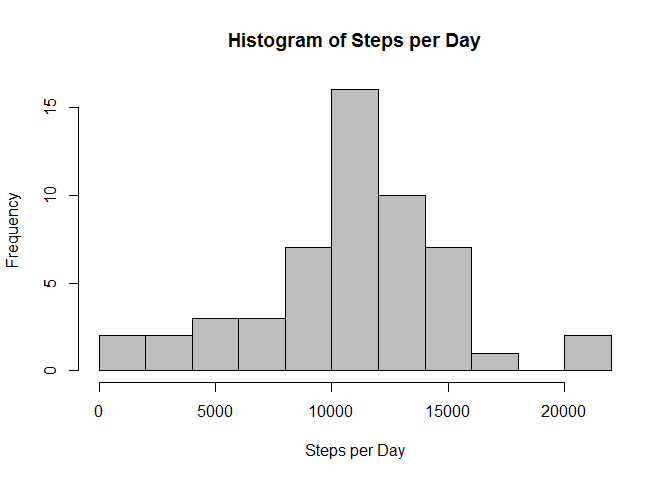
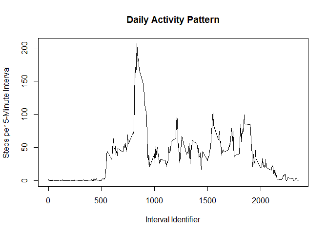
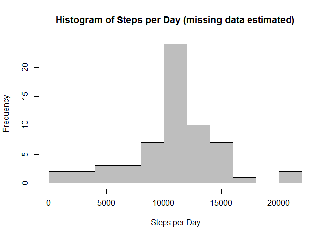
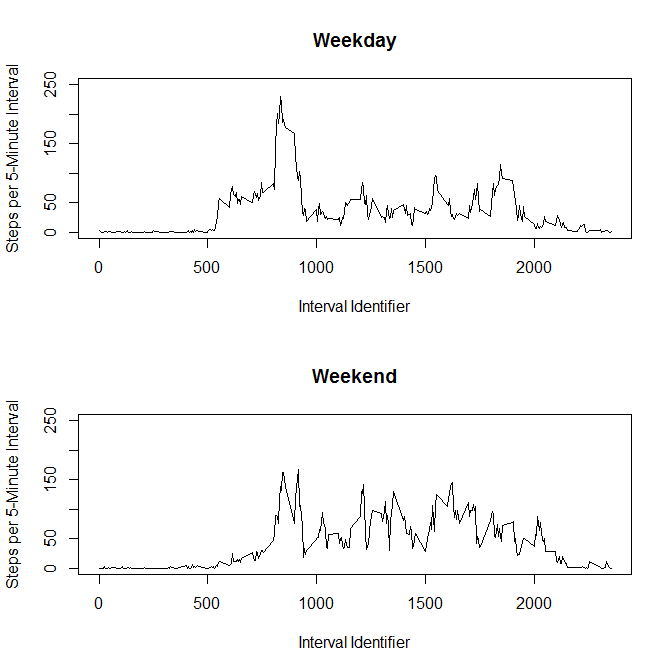

# Reproducible Research: Peer Assessment 1
Author: apmay

Date: November 15, 2015

The purpose of this report is to undertake and document an analysis which answers several questions about data from a personal activity monitoring device. The focus here is on reproducible research and presenting insights in a clear and reproducible manner. To the end, all code and explanations are incorporated into a single R markdown document which is processed by knitr and transformed into an HTML file.

## Loading and preprocessing the data
The data are contained in a zipped csv file from the provided repository. After unzipping the file and reading the data into R, the structure and summary of the data are worth examining. 


```r
filename <- unzip("activity.zip")
a.data <- read.csv(filename)
str(a.data); summary(a.data)
```

```
## 'data.frame':	17568 obs. of  3 variables:
##  $ steps   : int  NA NA NA NA NA NA NA NA NA NA ...
##  $ date    : Factor w/ 61 levels "2012-10-01","2012-10-02",..: 1 1 1 1 1 1 1 1 1 1 ...
##  $ interval: int  0 5 10 15 20 25 30 35 40 45 ...
```

```
##      steps                date          interval     
##  Min.   :  0.00   2012-10-01:  288   Min.   :   0.0  
##  1st Qu.:  0.00   2012-10-02:  288   1st Qu.: 588.8  
##  Median :  0.00   2012-10-03:  288   Median :1177.5  
##  Mean   : 37.38   2012-10-04:  288   Mean   :1177.5  
##  3rd Qu.: 12.00   2012-10-05:  288   3rd Qu.:1766.2  
##  Max.   :806.00   2012-10-06:  288   Max.   :2355.0  
##  NA's   :2304     (Other)   :15840
```

The structure and summary of the data shows that there are two formatting updates that should be made. First, the dates were read in as a factor variable and should be converted to date format. Second, there are some incomplete data in the steps variable. Another data set (a.data.rm) can be created which simply removes all rows where step data are missing.


```r
a.data$date <- as.Date(a.data$date)
a.data.rm <- a.data[!is.na(a.data$steps),]
```

## What is mean total number of steps taken per day?
One question immediately of interest is the mean number of steps taken per day. One way to account for missing data is to simply remove their entries from the data set. Here this procedure is undertaken. Missing data is removed, and steps are totaled for each day. Then both the mean and median steps per day are calculated based only on explicitly provided data.


```r
steps.daily <- tapply(a.data.rm$steps, a.data.rm$date, sum)
mean(steps.daily); median(steps.daily)
```

```
## [1] 10766.19
```

```
## [1] 10765
```

A histogram of the total steps taken per day provides a sense of the distribution in addition to the mean and median values above.


```r
num.break <- ceiling(sqrt(length(steps.daily)))
hist(steps.daily, breaks = num.break, col = "grey", xlab = "Steps per Day", main = "Histogram of Steps per Day")
```

 

## What is the average daily activity pattern?
Another area of interest is the average daily activity pattern, or how the number of steps per 5-minute interval changes throughout the course of a day. When the data are grouped by specific intervals, a time series plot of the mean steps per interval shows the average daily activity pattern.


```r
steps.interval <- tapply(a.data.rm$steps, a.data.rm$interval, mean)
plot(unique(a.data.rm$interval), steps.interval, type = "l", xlab = "Interval Identifier", ylab ="Steps per 5-Minute Interval", main = "Daily Activity Pattern")
```

 

The largest mean number of steps per 5-minute interval can be extracted along with the associated interval identifier.


```r
max(steps.interval); names(which(steps.interval == max(steps.interval))) 
```

```
## [1] 206.1698
```

```
## [1] "835"
```

## Imputing missing values
The periods of missing step data have the potential to bias the results, especially if there are many missing entries. Calculate the number of missing entries in the original data set.


```r
sum(is.na(a.data$steps))
```

```
## [1] 2304
```

Therefore, a verification should be performed by analyses where missing data is filled in with expected values for the missing data. One simple strategy for filling in the missing data is to take the original data set and fill in missing step data with mean step data from the associated interval identifier.


```r
a.data.fill <- a.data
a.data.fill$steps[is.na(a.data.fill$steps)] <- steps.interval[as.character(a.data.fill$interval[is.na(a.data.fill$steps)])]
```

The resulting completed data set can then be grouped by date and the steps totaled for each day. A histogram shows there has not been much change in shape from the previous (unfilled) data set. The main change is that now there are more days with data, as seen by the larger frequencies on the y-axis. 


```r
steps.daily.fill <- tapply(a.data.fill$steps, a.data.fill$date, sum)
hist(steps.daily.fill, breaks = num.break, col = "grey", xlab = "Steps per Day", main = "Histogram of Steps per Day (missing data estimated)")
```

 

Calculating the mean and median daily steps shows that filling in the missing data with expected values does not alter the results significantly. The mean value did not change, and the median value increased only minimally (+1.19).


```r
mean(steps.daily.fill); median(steps.daily.fill)
```

```
## [1] 10766.19
```

```
## [1] 10766.19
```

## Are there differences in activity patterns between weekdays and weekends?
The last area of interest is an activity pattern comparison between weekdays and weekends. The date data allows the data set to be split into two groups, one for weekdays and one for weekends. The mean number of steps per 5-minute interval is then taken for each group and the resulting time series plots are compared.


```r
a.data.fill$day <- weekdays(a.data.fill$date)
a.data.fill$wd.we <- "Weekday"
a.data.fill$wd.we[a.data.fill$day == "Saturday" | a.data.fill$day == "Sunday"] <- "Weekend"
a.data.fill$wd.we <- factor(a.data.fill$wd.we)

a.data.wdwe <- split(a.data.fill, a.data.fill$wd.we)
steps.interval.wd <- tapply(a.data.wdwe[[1]]$steps, a.data.wdwe[[1]]$interval, mean)
steps.interval.we <- tapply(a.data.wdwe[[2]]$steps, a.data.wdwe[[2]]$interval, mean)

par(mfrow = c(2,1))
plot(unique(a.data.fill$interval), steps.interval.wd, ylim = c(0,250), type = "l", xlab = "Interval Identifier", ylab = "Steps per 5-Minute Interval", main = "Weekday")
plot(unique(a.data.fill$interval), steps.interval.we, ylim = c(0,250), type = "l", xlab = "Interval Identifier", ylab = "Steps per 5-Minute Interval", main  = "Weekend")
```

 

From the panel plot there appears to be a couple notable differences between activity patterns on weekdays and weekends. First, weekdays tend to have a quicker average start to the day. Shortly after the interval identifier passes 500, the steps quickly surpass 50 steps per 5-minute interval. On the weekends there is a slow, gradual increase in steps per 5-minute interval starting around interval identifiers of 500-600. Second, weekdays have a strong activity peak around an interval identifier of 800 after which the activity decreases significantly. On the weekends, there is no real outstanding peak and the activity is more spread out throughout the 800-2000 interval identifiers.


